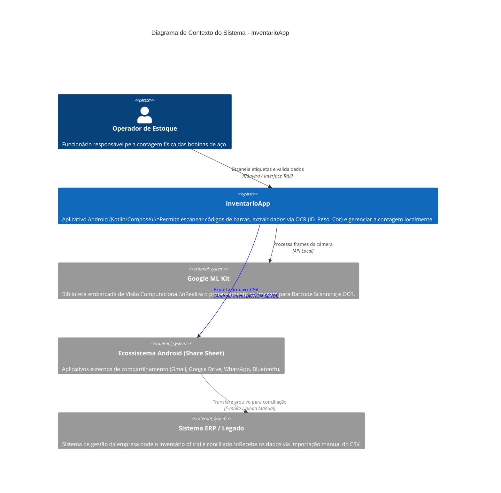
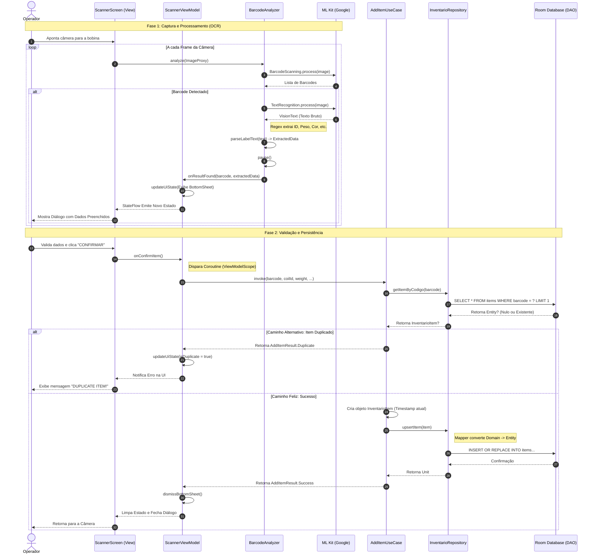
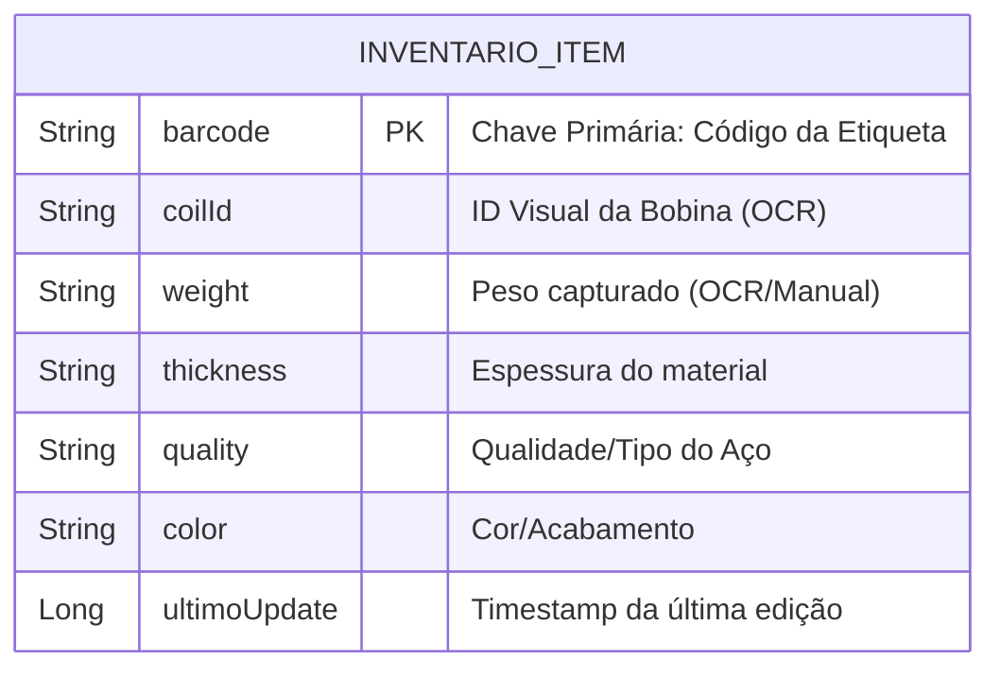

## 🏗 Arquitetura do Projeto

```mermaid

C4Context
title Diagrama de Contexto do Sistema - InventarioApp

    %% Atores
    Person(operador, "Operador de Estoque", "Funcionário responsável pela contagem física das bobinas de aço.")

    %% O Sistema em Desenvolvimento
    System(inventarioApp, "InventarioApp", "Aplicativo Android (Kotlin/Compose).\nPermite escanear códigos de barras, extrair dados via OCR (ID, Peso, Cor) e gerenciar a contagem localmente.")

    %% Sistemas Externos
    System_Ext(mlkit, "Google ML Kit", "Biblioteca embarcada de Visão Computacional.\nRealiza o processamento de imagem para Barcode Scanning e OCR.")
    System_Ext(android_share, "Ecossistema Android (Share Sheet)", "Aplicativos externos de compartilhamento (Gmail, Google Drive, WhatsApp, Bluetooth).")
    System_Ext(erp, "Sistema ERP / Legado", "Sistema de gestão da empresa onde o inventário oficial é conciliado.\nRecebe os dados via importação manual do CSV.")

    %% Relacionamentos
    Rel(operador, inventarioApp, "Escaneia etiquetas e valida dados", "Câmera / Interface Tátil")
    
    Rel(inventarioApp, mlkit, "Processa frames da câmera", "API Local")
    
    Rel(inventarioApp, android_share, "Exporta arquivo .CSV", "Android Intent (ACTION_SEND)")
    
    Rel(android_share, erp, "Transfere arquivo para conciliação", "E-mail / Upload Manual")
    
    UpdateRelStyle(inventarioApp, android_share, $textColor="blue", $lineColor="blue", $offsetX="-40", $offsetY="20")
    UpdateRelStyle(android_share, erp, $textColor="gray", $lineColor="gray", $offsetX="-30", $offsetY="20")
```

```mermaid 

sequenceDiagram
    autonumber
    actor User as Operador
    participant UI as ScannerScreen (View)
    participant VM as ScannerViewModel
    participant Analyzer as BarcodeAnalyzer
    participant ML as ML Kit (Google)
    participant UC as AddItemUseCase
    participant Repo as InventarioRepository
    participant DB as Room Database (DAO)

    Note over User, ML: Fase 1: Captura e Processamento (OCR)

    User->>UI: Aponta câmera para a bobina
    loop A cada Frame da Câmera
        UI->>Analyzer: analyze(ImageProxy)
        Analyzer->>ML: BarcodeScanning.process(image)
        ML-->>Analyzer: Lista de Barcodes
        
        alt Barcode Detectado
            Analyzer->>ML: TextRecognition.process(image)
            ML-->>Analyzer: VisionText (Texto Bruto)
            
            note right of Analyzer: Regex extrai ID, Peso, Cor, etc.
            Analyzer->>Analyzer: parseLabelText(text) -> ExtractedData
            
            Analyzer->>Analyzer: pause()
            Analyzer->>VM: onResultFound(barcode, extractedData)
            VM->>VM: updateUiState(Exibe BottomSheet)
            VM-->>UI: StateFlow Emite Novo Estado
            UI-->>User: Mostra Diálogo com Dados Preenchidos
        end
    end

    Note over User, DB: Fase 2: Validação e Persistência

    User->>UI: Valida dados e clica "CONFIRMAR"
    UI->>VM: onConfirmItem()
    
    note right of VM: Dispara Coroutine (ViewModelScope)
    VM->>UC: invoke(barcode, coilId, weight, ...)
    
    UC->>Repo: getItemByCodigo(barcode)
    Repo->>DB: SELECT * FROM items WHERE barcode = ? LIMIT 1
    DB-->>Repo: Retorna Entity? (Nulo ou Existente)
    Repo-->>UC: Retorna InventarioItem?

    alt Caminho Alternativo: Item Duplicado
        UC-->>VM: Retorna AddItemResult.Duplicate
        VM->>VM: updateUiState(isDuplicate = true)
        VM-->>UI: Notifica Erro na UI
        UI-->>User: Exibe mensagem "DUPLICATE ITEM!"
    
    else Caminho Feliz: Sucesso
        UC->>UC: Cria objeto InventarioItem (Timestamp atual)
        UC->>Repo: upsertItem(item)
        
        note right of Repo: Mapper converte Domain -> Entity
        Repo->>DB: INSERT OR REPLACE INTO items...
        DB-->>Repo: Confirmação
        Repo-->>UC: Retorna Unit
        
        UC-->>VM: Retorna AddItemResult.Success
        VM->>VM: dismissBottomSheet()
        VM-->>UI: Limpa Estado e Fecha Diálogo
        UI-->>User: Retorna para a Câmera
    end

```

```mermaid
erDiagram
    %% Entidade Principal definida em InventarioItemEntity.kt
    INVENTARIO_ITEM {
        String barcode PK "Chave Primária: Código da Etiqueta"
        String coilId "ID Visual da Bobina (OCR)"
        String weight "Peso capturado (OCR/Manual)"
        String thickness "Espessura do material"
        String quality "Qualidade/Tipo do Aço"
        String color "Cor/Acabamento"
        Long ultimoUpdate "Timestamp da última edição"
    }

    %% Notas sobre a arquitetura
    %% Como não há outras tabelas, não há linhas de relacionamento (1:N, N:M)
```
